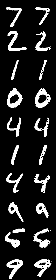

# Adversarial-Autoencoders
Adversarial Autoencoders implementation in Pytorch




```bash
Usage
- Install the dependencies
   - $ pip install -r requirements.txt
- Train the model
   - $ python3 train.py
- Test the reconstruction
   - $ python3 test.py
  ```
